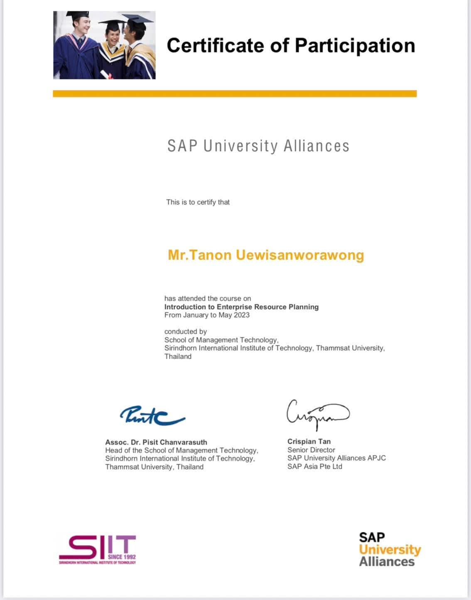
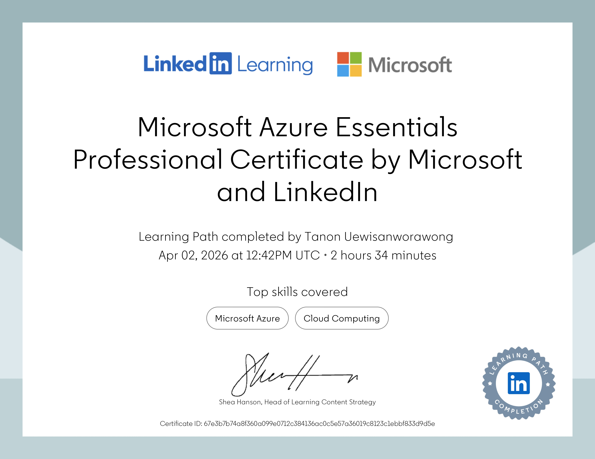

## Hi everyone, welcome to my data part 👋
---
PROFESSIONAL SUMMARY
---
Business Analyst with experience in supply chain, logistics, and retail operations, currently undertaking a master's degree in data science in the United Kingdom. Experienced in translating business requirements into data-driven and system-based solutions, with strong exposure to process automation, analytics, and cross-functional collaboration in multinational environments.

PROFESSIONAL EXPERIENCE
---
Business Analyst – Warehouse Management System (WMS)
CP AXTRA Public Company Limited (Makro & Lotus’s Group) | Bangkok (Hybrid)
 May 2025 – Dec 2025

- Led User Acceptance Testing (UAT) for an enterprise warehouse system (ECA), validating system integration across distribution centres and retail stores and accelerating operational adoption.
- Translated business and operational requirements into structured test scenarios, reducing post-deployment issues and improving system stability.
- Analyses Warehouse Management System (WMS) performance using Linux-based system monitoring tools and optimised SQL-driven data pipelines to enable accurate KPI tracking and faster decision-making.

Business Analyst & Data Management
Seafrigo Group – International Logistics & Cold Chain | Bangkok
 Jun 2024 – May 2025

- Partnered with operations, IT, and customer service teams to deliver data-driven system and process improvements across international logistics and cold chain operations.
- Analyzed logistics and shipment performance data to identify recurring inefficiencies, supporting initiatives that improved delivery reliability and cost control.
- Designed automated reporting and data management solutions using Microsoft Power Platform, Excel VBA, and BI tools, reducing manual data handling and improving management visibility.

Operational Excellence Associate
FairDee Insurtech | Bangkok
 Dec 2023 – Mar 2024

- Supported operational excellence initiatives by analyzing workflows and identifying process bottlenecks within insurance operations.
- Managed and analysed large operational datasets using SQL and internal systems to support data-driven decision-making.
- Contributed to workflow optimization plans that improved operational efficiency and resource allocation.

SKILL
---
- Data & Analytics: SQL, Python, R (basic), Advanced Excel, VBA, Power BI, Tableau
- Automation & Systems: Microsoft Power Apps, Power Automate, OCR Integration, System Monitoring (PuTTY)
- Business Skills: Requirements gathering, process optimization, stakeholder communication

CERTIFICATE & LICENSES
---

  

  

